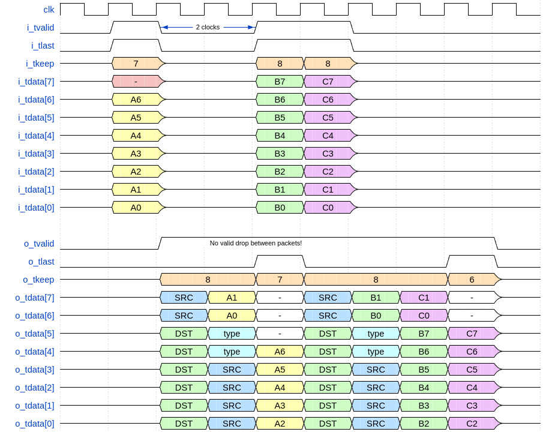
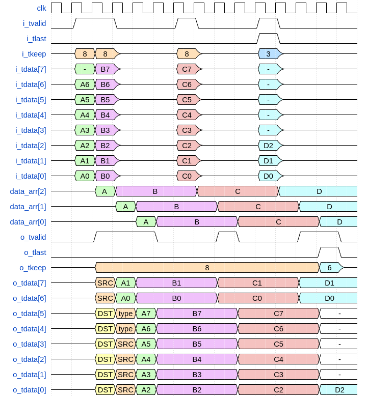
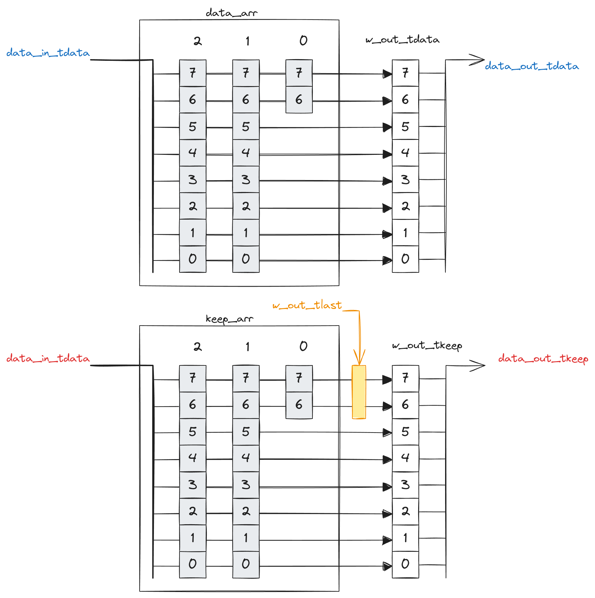
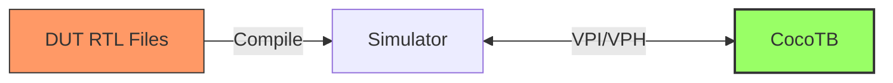
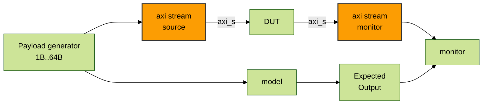
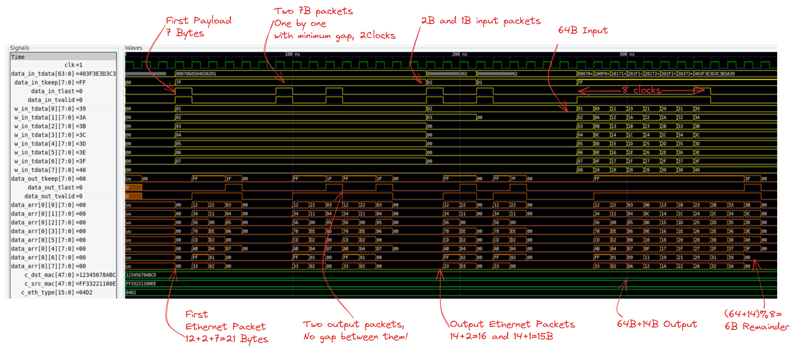
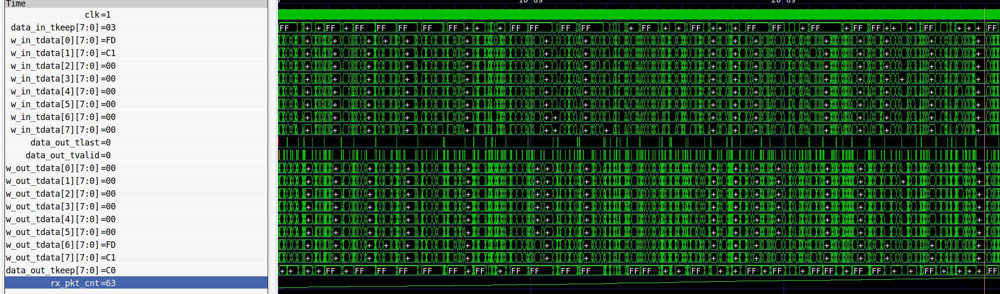

## Summary

Module recieves packet from AXI-Stream interface, append Ethernet Header at the beginning of packet and send it to output interface.
- Both input and output AXI-stream interfaces don't have backpressure, or `ready` signal
- Minumum gap between packets - 2 clock period should be maintained by sender. Kittens may be harmed otherwise. 
- Support any packet length from 1B with no upper limit
- Latency  1 clock (can be reduced)
- Support idle cycles (not-valid) in the middle of the packet
- Doesn't add any extra idle cycles or invalid bytes in the packet

Useful materials:
-  AXI-stream protocol spec https://developer.arm.com/documentation/ihi0051/latest/


>NOTE: In AXI Stream protocol signal `tkeep`  is a byte-valid mask. On the diagram bellow, `tkeep` shows the number of lower valid bytes.
Eg, an actual `tkeep` value `b0000_0111` is shown as `3` on the waveform, and waveform's tkeep value `8` corresponds to `b1111_1111` byte-mask

## Waveform without idles



## Packet with idles



## RTL deisgn

RTL structure is a pipeline with control logic implemented in VHDL 93.
Ethernet header parameters are synthethis-time defined constants.

General purpouse code is moved to the separate package [byte_arr_pkg.rtl.vhd](vhd/byte_arr_pkg.rtl.vhd) and top level is implemented as one entity in the [eth_header.rtl.vhd](vhd/eth_header.rtl.vhd)




## Simulation & Verificaton


### How to run simulation

Activate conda and then:

```sh
# For debian-based only
sudo apt-get install ghdl

# Create and activate conda env from file
conda env create -f environment.yml
conda activate cocotb_env

# Run all
make 
```

**Dependencies:**

- `GHDL` - GHDL is an open-source simulator for the VHDL language. Edit `Makefile` to pick sumulator of your choice, see the [guide](https://docs.cocotb.org/en/stable/simulator_support.html)
- `cocotb` - Python library, that interacts with compiled DUT via VPI interface
- `cocotb-bus` - useful extensions for cocotb
- `cocotbext-axi` - AXI Bus implementations for cocotb
- `scapy` - Network packet manipulation library, it's used to generate expected Ethernet packets
- `numpy` - Numerical library for python



### Cocotb Testbench 


Testbench file a class `EthernetHeaderTB`



### Basic Test

To run a specific testcase, envoke `make TESTCASE=basic_test`. 
Testcase `def basic_test(dut):` will instantiate `EthernetHeaderTB` object and send several packets.

Cocotb will store results of simulation to `waveform.ghw` file.
To view the waveform file, install `gtkwave` and run `gtkwave waveform.ghw`

See waveform screenshot and log file bellow:



<details>
  <summary>Click me to see Cocotb Run Log</summary>


```log
(cocotb_env) kvinogradov@blackbox:~/work/fpga/bb_eth_header_test$ make TESTCASE=basic_test
    20.00ns DEBUG    cocotb.eth_header                  Send 7B payload
    
    20.00ns DEBUG    cocotb.eth_header                  Payload         : 01 02 03 04 05 06 07 
    20.00ns DEBUG    cocotb.eth_header                  Expected Packet : 12 34 56 78 AB CD FF 33 22 11 00 EE 04 D2 01 02 03 04 05 06 07 
    30.00ns INFO     cocotb.eth_header.data_in          TX frame: AxiStreamFrame(tdata=bytearray(b'\x01\x02\x03\x04\x05\x06\x07'), tkeep=None, tid=None, tdest=None, tuser=None, sim_time_start=30000000, sim_time_end=None)
    70.00ns INFO     cocotb.eth_header.data_out         RX frame: AxiStreamFrame(tdata=bytearray(b'\x124Vx\xab\xcd\xff3"\x11\x00\xee\x04\xd2\x01\x02\x03\x04\x05\x06\x07\x00\x00\x00'), tkeep=[1, 1, 1, 1, 1, 1, 1, 1, 1, 1, 1, 1, 1, 1, 1, 1, 1, 1, 1, 1, 1, 0, 0, 0], tid=[], tdest=[], tuser=[], sim_time_start=50000000, sim_time_end=70000000)
    70.00ns DEBUG    cocotb.eth_header                  Correctly recieved 21B packet
    80.00ns DEBUG    cocotb.eth_header                  Send 7B payload twice one by one
    
    80.00ns DEBUG    cocotb.eth_header                  Payload         : 01 02 03 04 05 06 07 
    80.00ns DEBUG    cocotb.eth_header                  Expected Packet : 12 34 56 78 AB CD FF 33 22 11 00 EE 04 D2 01 02 03 04 05 06 07 
    90.00ns INFO     cocotb.eth_header.data_in          TX frame: AxiStreamFrame(tdata=bytearray(b'\x01\x02\x03\x04\x05\x06\x07'), tkeep=None, tid=None, tdest=None, tuser=None, sim_time_start=90000000, sim_time_end=None)
   
   110.00ns DEBUG    cocotb.eth_header                  Payload         : 01 02 03 04 05 06 07 
   110.00ns DEBUG    cocotb.eth_header                  Expected Packet : 12 34 56 78 AB CD FF 33 22 11 00 EE 04 D2 01 02 03 04 05 06 07 
   120.00ns INFO     cocotb.eth_header.data_in          TX frame: AxiStreamFrame(tdata=bytearray(b'\x01\x02\x03\x04\x05\x06\x07'), tkeep=None, tid=None, tdest=None, tuser=None, sim_time_start=120000000, sim_time_end=None)
   130.00ns INFO     cocotb.eth_header.data_out         RX frame: AxiStreamFrame(tdata=bytearray(b'\x124Vx\xab\xcd\xff3"\x11\x00\xee\x04\xd2\x01\x02\x03\x04\x05\x06\x07\x00\x00\x00'), tkeep=[1, 1, 1, 1, 1, 1, 1, 1, 1, 1, 1, 1, 1, 1, 1, 1, 1, 1, 1, 1, 1, 0, 0, 0], tid=[], tdest=[], tuser=[], sim_time_start=110000000, sim_time_end=130000000)
   130.00ns DEBUG    cocotb.eth_header                  Correctly recieved 21B packet
   160.00ns INFO     cocotb.eth_header.data_out         RX frame: AxiStreamFrame(tdata=bytearray(b'\x124Vx\xab\xcd\xff3"\x11\x00\xee\x04\xd2\x01\x02\x03\x04\x05\x06\x07\x00\x00\x00'), tkeep=[1, 1, 1, 1, 1, 1, 1, 1, 1, 1, 1, 1, 1, 1, 1, 1, 1, 1, 1, 1, 1, 0, 0, 0], tid=[], tdest=[], tuser=[], sim_time_start=140000000, sim_time_end=160000000)
   160.00ns DEBUG    cocotb.eth_header                  Correctly recieved 21B packet
   170.00ns DEBUG    cocotb.eth_header                  Send 2B payload and 1B payload
   
   170.00ns DEBUG    cocotb.eth_header                  Payload         : 02 03 
   170.00ns DEBUG    cocotb.eth_header                  Expected Packet : 12 34 56 78 AB CD FF 33 22 11 00 EE 04 D2 02 03 
   180.00ns INFO     cocotb.eth_header.data_in          TX frame: AxiStreamFrame(tdata=bytearray(b'\x02\x03'), tkeep=None, tid=None, tdest=None, tuser=None, sim_time_start=180000000, sim_time_end=None)
   
   200.00ns DEBUG    cocotb.eth_header                  Payload         : 02 
   200.00ns DEBUG    cocotb.eth_header                  Expected Packet : 12 34 56 78 AB CD FF 33 22 11 00 EE 04 D2 02 
   210.00ns INFO     cocotb.eth_header.data_out         RX frame: AxiStreamFrame(tdata=bytearray(b'\x124Vx\xab\xcd\xff3"\x11\x00\xee\x04\xd2\x02\x03'), tkeep=[1, 1, 1, 1, 1, 1, 1, 1, 1, 1, 1, 1, 1, 1, 1, 1], tid=[], tdest=[], tuser=[], sim_time_start=200000000, sim_time_end=210000000)
   210.00ns INFO     cocotb.eth_header.data_in          TX frame: AxiStreamFrame(tdata=bytearray(b'\x02'), tkeep=None, tid=None, tdest=None, tuser=None, sim_time_start=210000000, sim_time_end=None)
   210.00ns DEBUG    cocotb.eth_header                  Correctly recieved 16B packet
   240.00ns INFO     cocotb.eth_header.data_out         RX frame: AxiStreamFrame(tdata=bytearray(b'\x124Vx\xab\xcd\xff3"\x11\x00\xee\x04\xd2\x02\x00'), tkeep=[1, 1, 1, 1, 1, 1, 1, 1, 1, 1, 1, 1, 1, 1, 1, 0], tid=[], tdest=[], tuser=[], sim_time_start=230000000, sim_time_end=240000000)
   240.00ns DEBUG    cocotb.eth_header                  Correctly recieved 15B packet

   260.00ns DEBUG    cocotb.eth_header                  Payload         : 01 02 03 04 05 06 07 08 09 0A 0B 0C 0D 0E 0F 10 11 12 13 14 15 16 17 18 19 1A 1B 1C 1D 1E 1F 20 21 22 23 24 25 26 27 28 29 2A 2B 2C 2D 2E 2F 30 31 32 33 34 35 36 37 38 39 3A 3B 3C 3D 3E 3F 40 
   260.00ns DEBUG    cocotb.eth_header                  Expected Packet : 12 34 56 78 AB CD FF 33 22 11 00 EE 04 D2 01 02 03 04 05 06 07 08 09 0A 0B 0C 0D 0E 0F 10 11 12 13 14 15 16 17 18 19 1A 1B 1C 1D 1E 1F 20 21 22 23 24 25 26 27 28 29 2A 2B 2C 2D 2E 2F 30 31 32 33 34 35 36 37 38 39 3A 3B 3C 3D 3E 3F 40 
   270.00ns INFO     cocotb.eth_header.data_in          TX frame: AxiStreamFrame(tdata=bytearray(b'\x01\x02\x03\x04\x05\x06\x07\x08\t\n\x0b\x0c\r\x0e\x0f\x10\x11\x12\x13\x14\x15\x16\x17\x18\x19\x1a\x1b\x1c\x1d\x1e\x1f !"#$%&\'()*+,-./0123456789:;<=>?@'), tkeep=None, tid=None, tdest=None, tuser=None, sim_time_start=270000000, sim_time_end=None)
   380.00ns INFO     cocotb.eth_header.data_out         RX frame: AxiStreamFrame(tdata=bytearray(b'\x124Vx\xab\xcd\xff3"\x11\x00\xee\x04\xd2\x01\x02\x03\x04\x05\x06\x07\x08\t\n\x0b\x0c\r\x0e\x0f\x10\x11\x12\x13\x14\x15\x16\x17\x18\x19\x1a\x1b\x1c\x1d\x1e\x1f !"#$%&\'()*+,-./0123456789:;<=>?@\x00\x00'), tkeep=[1, 1, 1, 1, 1, 1, 1, 1, 1, 1, 1, 1, 1, 1, 1, 1, 1, 1, 1, 1, 1, 1, 1, 1, 1, 1, 1, 1, 1, 1, 1, 1, 1, 1, 1, 1, 1, 1, 1, 1, 1, 1, 1, 1, 1, 1, 1, 1, 1, 1, 1, 1, 1, 1, 1, 1, 1, 1, 1, 1, 1, 1, 1, 1, 1, 1, 1, 1, 1, 1, 1, 1, 1, 1, 1, 1, 1, 1, 0, 0], tid=[], tdest=[], tuser=[], sim_time_start=290000000, sim_time_end=380000000)
   380.00ns DEBUG    cocotb.eth_header                  Correctly recieved 78B packet
   390.00ns INFO     cocotb.regression                  basic_test passed
   
   390.00ns INFO     cocotb.regression                  **************************************************************************************
                                                        ** TEST                          STATUS  SIM TIME (ns)  REAL TIME (s)  RATIO (ns/s) **
                                                        **************************************************************************************
                                                        ** test_eth_header.basic_test     PASS         390.00           0.02      19919.13  **
                                                        **************************************************************************************
                                                        ** TESTS=1 PASS=1 FAIL=0 SKIP=0                390.00           0.36       1089.07  **
                                                        **************************************************************************************
```

</details>


### Idle Test

Simulate idles (non-valid) cycles during transaction.

```
make TESTCASE=test_idles
```


```python
@cocotb.test()
async def test_idles(dut):
    tb = EthernetHeaderTB(dut, debug=True)
    await tb.launch()
    tb.stream_in.set_pause_generator(cycle_pause())
    for n in [16,17,18,23]:
        frame = (np.arange(n, dtype=np.uint8)).tobytes()
        await tb.send(frame)
        for i in range(5):
            await RisingEdge(dut.clk)  
    # 2 periods for header + 1 period for latency
    tb.assert_state()
```

<details>
  <summary>Click me to see Cocotb Run Log</summary>

```
(base) kvinogradov@blackbox:~/work/fpga/bb_eth_header_test$ make TESTCASE=test_idles

  Payload         : 00 01 02 03 04 05 06 07 08 09 0A 0B 0C 0D 0E 0F 
  Expected Packet : 12 34 56 78 AB CD FF 33 22 11 00 EE 04 D2 00 01 02 03 04 05 06 07 08 09 0A 0B 0C 0D 0E 0F 
  Reset de-asserted
  Reset de-asserted
  TX frame: AxiStreamFrame(tdata=bytearray(b'\x00\x01\x02\x03\x04\x05\x06\x07\x08\t\n\x0b\x0c\r\x0e\x0f'), tkeep=None, tid=None, tdest=None, tuser=None, sim_time_start=30000000, sim_time_end=None)
  RX frame: AxiStreamFrame(tdata=bytearray(b'\x124Vx\xab\xcd\xff3"\x11\x00\xee\x04\xd2\x00\x01\x02\x03\x04\x05\x06\x07\x08\t\n\x0b\x0c\r\x0e\x0f\x08\t'), tkeep=[1, 1, 1, 1, 1, 1, 1, 1, 1, 1, 1, 1, 1, 1, 1, 1, 1, 1, 1, 1, 1, 1, 1, 1, 1, 1, 1, 1, 1, 1, 0, 0], tid=[], tdest=[], tuser=[], sim_time_start=70000000, sim_time_end=130000000)
  Correctly recieved 30B packet

  Payload         : 00 01 02 03 04 05 06 07 08 09 0A 0B 0C 0D 0E 0F 10 
  Expected Packet : 12 34 56 78 AB CD FF 33 22 11 00 EE 04 D2 00 01 02 03 04 05 06 07 08 09 0A 0B 0C 0D 0E 0F 10 
  TX frame: AxiStreamFrame(tdata=bytearray(b'\x00\x01\x02\x03\x04\x05\x06\x07\x08\t\n\x0b\x0c\r\x0e\x0f\x10'), tkeep=None, tid=None, tdest=None, tuser=None, sim_time_start=170000000, sim_time_end=None)
  RX frame: AxiStreamFrame(tdata=bytearray(b'\x124Vx\xab\xcd\xff3"\x11\x00\xee\x04\xd2\x00\x01\x02\x03\x04\x05\x06\x07\x08\t\n\x0b\x0c\r\x0e\x0f\x10\x00'), tkeep=[1, 1, 1, 1, 1, 1, 1, 1, 1, 1, 1, 1, 1, 1, 1, 1, 1, 1, 1, 1, 1, 1, 1, 1, 1, 1, 1, 1, 1, 1, 1, 0], tid=[], tdest=[], tuser=[], sim_time_start=190000000, sim_time_end=280000000)
  Correctly recieved 31B packet

  Payload         : 00 01 02 03 04 05 06 07 08 09 0A 0B 0C 0D 0E 0F 10 11 
  Expected Packet : 12 34 56 78 AB CD FF 33 22 11 00 EE 04 D2 00 01 02 03 04 05 06 07 08 09 0A 0B 0C 0D 0E 0F 10 11 
  TX frame: AxiStreamFrame(tdata=bytearray(b'\x00\x01\x02\x03\x04\x05\x06\x07\x08\t\n\x0b\x0c\r\x0e\x0f\x10\x11'), tkeep=None, tid=None, tdest=None, tuser=None, sim_time_start=330000000, sim_time_end=None)
  RX frame: AxiStreamFrame(tdata=bytearray(b'\x124Vx\xab\xcd\xff3"\x11\x00\xee\x04\xd2\x00\x01\x02\x03\x04\x05\x06\x07\x08\t\n\x0b\x0c\r\x0e\x0f\x10\x11'), tkeep=[1, 1, 1, 1, 1, 1, 1, 1, 1, 1, 1, 1, 1, 1, 1, 1, 1, 1, 1, 1, 1, 1, 1, 1, 1, 1, 1, 1, 1, 1, 1, 1], tid=[], tdest=[], tuser=[], sim_time_start=350000000, sim_time_end=440000000)
  Correctly recieved 32B packet

  Payload         : 00 01 02 03 04 05 06 07 08 09 0A 0B 0C 0D 0E 0F 10 11 12 13 14 15 16 
  Expected Packet : 12 34 56 78 AB CD FF 33 22 11 00 EE 04 D2 00 01 02 03 04 05 06 07 08 09 0A 0B 0C 0D 0E 0F 10 11 12 13 14 15 16 
  TX frame: AxiStreamFrame(tdata=bytearray(b'\x00\x01\x02\x03\x04\x05\x06\x07\x08\t\n\x0b\x0c\r\x0e\x0f\x10\x11\x12\x13\x14\x15\x16'), tkeep=None, tid=None, tdest=None, tuser=None, sim_time_start=490000000, sim_time_end=None)
  RX frame: AxiStreamFrame(tdata=bytearray(b'\x124Vx\xab\xcd\xff3"\x11\x00\xee\x04\xd2\x00\x01\x02\x03\x04\x05\x06\x07\x08\t\n\x0b\x0c\r\x0e\x0f\x10\x11\x12\x13\x14\x15\x16\x00\x10\x11'), tkeep=[1, 1, 1, 1, 1, 1, 1, 1, 1, 1, 1, 1, 1, 1, 1, 1, 1, 1, 1, 1, 1, 1, 1, 1, 1, 1, 1, 1, 1, 1, 1, 1, 1, 1, 1, 1, 1, 0, 0, 0], tid=[], tdest=[], tuser=[], sim_time_start=510000000, sim_time_end=610000000)
  Correctly recieved 37B packet

  test_idles passed
  **************************************************************************************
** TEST                          STATUS  SIM TIME (ns)  REAL TIME (s)  RATIO (ns/s) **
**************************************************************************************
** test_eth_header.test_idles     PASS         640.00           0.02      29914.24  **
**************************************************************************************
** TESTS=1 PASS=1 FAIL=0 SKIP=0                640.00           0.52       1221.10  **
```

</details>

### Regression testing

Regression testing is implement with `TestFactory`. 
`TestFactory` invokes test function `run_test` with different combinations of arguments

Specific test `make TESTCASE=run_test_006`:



```py
factory = TestFactory(run_test)
# idle_inserter - insert gaps, or non-valid periods, to input AXI stream
#       None        - no gaps, always valid
#       cycle_pause - repeated pattern of zeros and ones
#       random_ones - random pauses
# payload_gen_func - payload generation function
#       payload_counter - produces incrementing size packet (1B,2B, 3B) with 8b counter values of bytes
#       payload_random - generate random packet with random bytes values
factory.add_option("idle_inserter",    [None, cycle_pause, random_ones])
factory.add_option("payload_gen_func", [payload_counter,payload_random])
factory.generate_tests()
```
<details>
  <summary>Click me to see Cocotb Run Log</summary>

```log
   390.00ns INFO     cocotb.regression                  running run_test_001 (2/7)
                                                          Automatically generated test
                                                          
                                                          idle_inserter: None
                                                          payload_gen_func: payload_counter (Generate payload, where each byte is incrementing counter value)

  4600.00ns INFO     cocotb.regression                  running run_test_002 (3/7)
                                                          Automatically generated test
                                                          idle_inserter: None
                                                          payload_gen_func: payload_random (Generate Random payload)
  8920.00ns INFO     cocotb.regression                  run_test_002 passed

  8920.00ns INFO     cocotb.regression                  running run_test_003 (4/7)
                                                          Automatically generated test
                                                          idle_inserter: cycle_pause (Mostly ones)
                                                          payload_gen_func: payload_counter (Generate payload, where each byte is incrementing counter value)
 20500.00ns INFO     cocotb.regression                  run_test_003 passed
 
 20500.00ns INFO     cocotb.regression                  running run_test_004 (5/7)
                                                          Automatically generated test
                                                          idle_inserter: cycle_pause (Mostly ones)
                                                          payload_gen_func: payload_random (Generate Random payload)
 31960.00ns INFO     cocotb.regression                  run_test_004 passed
 
 31960.00ns INFO     cocotb.regression                  running run_test_005 (6/7)
                                                          Automatically generated test
                                                          idle_inserter: random_ones (Random ones and zeros)
                                                          payload_gen_func: payload_counter (Generate payload, where each byte is incrementing counter value)
 60500.00ns INFO     cocotb.regression                  run_test_005 passed
 
 60500.00ns INFO     cocotb.regression                  running run_test_006 (7/7)
                                                          Automatically generated test
                                                          idle_inserter: random_ones (Random ones and zeros)
                                                          payload_gen_func: payload_random (Generate Random payload)
 84970.00ns INFO     cocotb.regression                  run_test_006 passed
 84970.00ns INFO     cocotb.regression                  **************************************************************************************
                                                        ** TEST                          STATUS  SIM TIME (ns)  REAL TIME (s)  RATIO (ns/s) **
                                                        **************************************************************************************
                                                        ** test_eth_header.basic_test     PASS         390.00           0.02      17948.96  **
                                                        ** test_eth_header.run_test_001   PASS        4210.00           0.13      31355.30  **
                                                        ** test_eth_header.run_test_002   PASS        4320.00           0.16      27501.09  **
                                                        ** test_eth_header.run_test_003   PASS       11580.00           0.27      43655.36  **
                                                        ** test_eth_header.run_test_004   PASS       11460.00           0.27      42871.51  **
                                                        ** test_eth_header.run_test_005   PASS       28540.00           0.50      57073.47  **
                                                        ** test_eth_header.run_test_006   PASS       24470.00           0.44      55481.41  **
                                                        **************************************************************************************
                                                        ** TESTS=7 PASS=7 FAIL=0 SKIP=0              84970.00           2.15      39482.91  **
                                                        **************************************************************************************
```

</details>